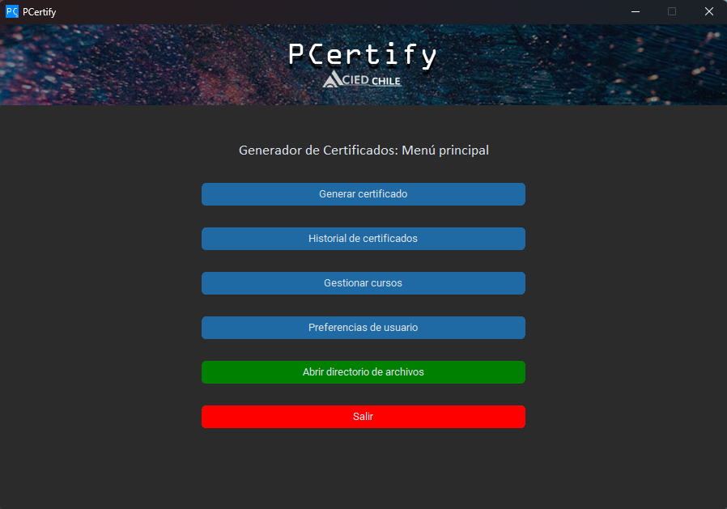

# PCertify

[](https://www.python.org/)
[](https://github.com/TomSchimansky/CustomTkinter)
[](https://aws.amazon.com/s3/)
[](https://sqlite.org/)

**PCertify** es una solución de escritorio diseñada para automatizar la creación, gestión y validación de certificados de capacitación profesional para CIEDCHILE SPA. El sistema integra la generación dinámica de documentos PDF con la validación mediante códigos QR almacenados en la nube.

---

<p align="center">
  
  <br>
  <em>Vista principal de la aplicación</em>
</p>
---


## Características Principales

* **Generación de Certificados Dinámicos:** Creación de documentos PDF personalizados utilizando `ReportLab` y `Pillow`, con ajuste automático de texto y diseño profesional.
* **Integración Cloud (AWS S3):** Carga automática de certificados a un bucket de Amazon S3 para su disponibilidad global y acceso mediante códigos QR.
* **Validación con QR:** Generación de códigos QR únicos que enlazan directamente al certificado almacenado en la nube, permitiendo la verificación inmediata de la autenticidad.
* **Gestión de Base de Datos:** Persistencia local mediante **SQLite** para el manejo de cursos, participantes y preferencias del sistema.
* **Interfaz de Usuario Moderna:** UI construida con `CustomTkinter`.
* **Seguridad de Datos:** Encriptación de credenciales sensibles con `Fernet` (Criptografía).

## Stack Tecnológico

* **Lenguaje:** Python 3.12
* **Interfaz Gráfica:** CustomTkinter
* **Procesamiento de Imágenes/PDF:** Pillow, ReportLab
* **Nube:** Boto3 (AWS SDK para Python)
* **Base de Datos:** SQLite3
* **Otros:** `qrcode` para la generación de códigos, `python-dotenv` para gestión de variables de entorno.

---

## Configuración del Entorno

### Requisitos Previos
* Contar con una cuenta de AWS y un bucket S3 configurado.
* Python 3.12 instalado.

### Instalación
1.  Clonar el repositorio:
    ```bash
    git clone https://github.com/ipsoteric/PCertify
    ```
2.  Instalar dependencias:
    ```bash
    pip install -r requirements.txt
    ```
3.  Configurar variables de entorno (`.env`):
    ```env
    SECRET_KEY=tu_clave_fernet_generada
    AWS_ACCESS_KEY_ID=TU_ACCESS_KEY
    AWS_SECRET_ACCESS_KEY=TU_SECRET_KEY
    AWS_REGION_NAME=TU_REGION_AWS
    AWS_S3_BUCKET_NAME=NOMBRE_DE_TU_BUCKET
    ```